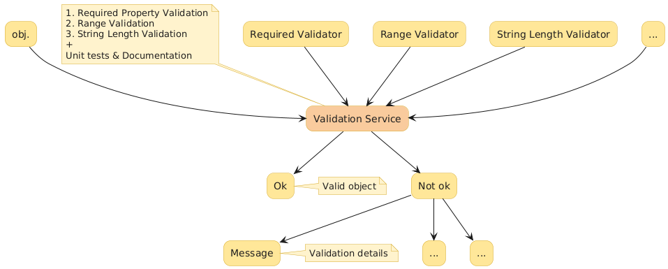
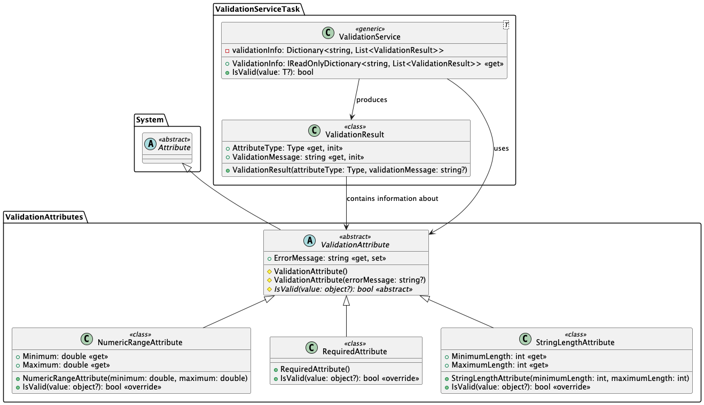

# Custom Validation Service

- Develop a custom validation attributes (Don't use [ValidationAttribute](https://docs.microsoft.com/en-us/dotnet/api/system.componentmodel.dataannotations.validationattribute)) for a fields and properties only
    - `StringLengthAttribute` wich specifies the minimum and maximum length of characters that are allowed in a data field;
    - `RequiredAttribute` wich specifies that a data field value is required;
    - `RangeAttribute` wich specifies the numeric range constraints for the value of a data field.
- Develop a validation service class for a objects validation of any type `T`.
    - The method `IsValid` of validation service return true if incoming object is valid and false overwise.
    - If the incoming in `IsValid` method object is invalid, the validation service provides information about the error messages registered for this object.

## Task Description

Implement a validation service in C# that uses custom validation attributes to validate properties and fields of objects. The service should be able to handle various types of validation attributes, such as `RequiredAttribute`, `StringLengthAttribute`, and `NumericRangeAttribute`.

#### Requirements
1. **Validation Service**:
    - Implement a generic `ValidationService<T>` class that provides methods to validate objects of type `T`.
    - The service should collect validation information and determine if an object is valid based on the custom validation attributes applied to its properties and fields.

2. **Validation Attributes**:
    - Implement custom validation attributes that inherit from a base `ValidationAttribute` class.
    - The attributes should include:
        - `RequiredAttribute`: Ensures a property or field is not null.
        - `StringLengthAttribute`: Validates the length of a string.
        - `NumericRangeAttribute`: Validates that a numeric value falls within a specified range.

3. **Validation Information**:
    - Implement a `ValidationResult` class to store information about validation errors, including the type of validation attribute and the validation message.

#### Implementation Details

1. **ValidationService<T> Class**:
    - The class should have methods to validate properties and fields of an object.
    - It should collect validation errors in a dictionary and provide a method to retrieve this information.
    - The `IsValid` method should return `true` if the object is valid, otherwise `false`.

2. **ValidationAttribute Class**:
    - This abstract class should define a method `IsValid` that must be overridden by derived classes to implement specific validation logic.
    - It should also have an `ErrorMessage` property to store the validation error message.

3. **Custom Validation Attributes**:
    - `RequiredAttribute`: Validates that a property or field is not null.
    - `StringLengthAttribute`: Validates that the length of a string is within a specified range.
    - `NumericRangeAttribute`: Validates that a numeric value is within a specified range.

4. **ValidationResult Class**:
    - This class stores the type of validation attribute and the validation message.
    - It provides a constructor for easy initialization of its properties.

## Architecture

This diagram illustrates how an object passes through the `ValidationService`.
The service aggregates results from specific validators (`Required`, `Range`, `StringLength`),
and routes the outcome either to a successful state or a set of validation messages.

The class diagram shows the custom attribute hierarchy and the `ValidationService<T>` composition.
`ValidationAttribute` defines the base contract, while concrete attributes implement value-specific checks.
`ValidationService<T>` keeps `ValidationResult` entries that tests use via the `ValidationInfo` property.
