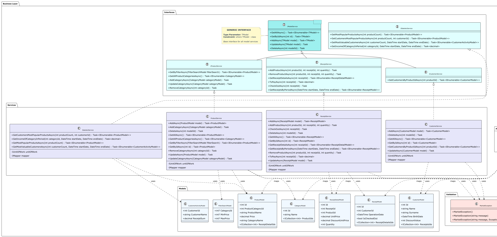

# Layered Marketplace Web API — Step-by-Step Implementation

## Table of Contents
- [Overview](#overview)
- [Project Architecture](#project-architecture)
    - [Domain Model](#domain-model)
    - [Project Structure](#project-structure)
    - [Architecture Diagrams](#architecture-diagrams)
- [Step-by-Step Implementation](#step-by-step-implementation)
    - [Step 1: Data Layer](#step-1-data-layer)
    - [Step 2: Business Layer](#step-2-business-layer)
    - [Step 3: Web API Layer](#step-3-webapi-layer)
- [Working with Git Branches](#working-with-git-branches)
- [Setup and Getting Started](#setup-and-getting-started)
- [Testing and Validation](#testing-and-validation)
- [Common Issues and Solutions](#common-issues-and-solutions)
- [Deliverables and Evaluation](#deliverables-and-evaluation)

## Overview

You are provided with a ready-to-use solution skeleton for a multi-layered Marketplace application. The solution follows a classic architecture: 
- **Data Layer** (repositories, entities, EF Core)
- **Business Layer** (services, models, validation)
- **Web API Layer** (controllers, DI, API endpoints)
  
The project includes comprehensive unit and integration tests for each step.

**Goal**: Implement business logic and data access in three incremental steps, each corresponding to a separate GitHub branch. At each step, you will run the provided tests to validate your implementation.

## Project Architecture

### Domain Model

The application represents a trading market management system with the following main entities:

- **Customer** - buyer with personal data (name, surname, birth date) and discount
- **Product** - product with name, price and category
- **ProductCategory** - category for grouping products
- **Receipt** - purchase document linked to a customer
- **ReceiptDetail** - receipt line items with quantity and product price

### Project Structure

```
marketpl-tests-main/
├── Data/                          # Data Access Layer
│   ├── Entities/                  # Domain entities
│   ├── Repositories/              # Repository implementations
│   ├── Interfaces/                # Repository interfaces
│   ├── Data/                      # DbContext and UnitOfWork
│   ├── Migrations/                # EF Core migrations
│   ├── DataLayerClassDiagram.puml # Data layer architecture
│   └── DataEntitiesDiagram.puml   # Entity relationships
├── Business/                      # Business Logic Layer
│   ├── Services/                  # Business service implementations
│   ├── Interfaces/                # Service interfaces
│   ├── Models/                    # DTOs and business models
│   ├── Validation/                # Custom exceptions
│   ├── AutomapperProfile.cs       # Object mapping configuration
│   └── BusinessLayerClassDiagram.puml # Business layer architecture
├── WebApi/                        # Presentation Layer
│   ├── Controllers/               # API controllers
│   ├── Services/                  # Web API services
│   ├── Program.cs                 # Application startup
│   └── appsettings.json          # Configuration
├── Business.Tests/                # Business layer unit tests
├── Data.Tests/                    # Data layer unit tests
├── WebApi.Tests/                  # Integration tests
└── README.md                      # This file
```

### Architecture Diagrams

#### 1. Simplified Architecture Diagram


#### 2. Detailed Architecture diagram

Click the diagram for details.  


#### 3. Data Entities Diagram


#### 4. Business Models Diagram


#### 5. Business Layer Class Diagram

Click the diagram for details   


### Layer Responsibilities

#### Data Layer (`Data/`)
- **Entities**: Domain models representing database tables
- **Repositories**: Data access abstraction layer with CRUD operations
- **UnitOfWork**: Transaction management and repository coordination
- **DbContext**: Entity Framework Core context configuration

#### Business Layer (`Business/`)
- **Services**: Business logic implementation and orchestration
- **Models**: Data Transfer Objects (DTOs) for API communication
- **Validation**: Business rules enforcement and custom exceptions
- **AutoMapper**: Object mapping between entities and DTOs

#### Web API Layer (`WebApi/`)
- **Controllers**: REST API endpoints and HTTP request handling
- **Dependency Injection**: Service registration and lifetime management
- **Configuration**: Application settings and startup logic
- **Documentation**: Swagger/OpenAPI integration

---

## Step-by-Step Implementation

### Step 1: Data Layer (`epic/01-data`)

**Goal**: Implement repositories for database operations

**What to do**:
- Implement repository logic for all entities (CRUD operations, queries)
- Configure Entity Framework Core context and migrations
- Implement UnitOfWork pattern for transaction management

**Entities to implement**:
- `CustomerRepository` - work with customers
- `ProductRepository` - work with products
- `ProductCategoryRepository` - work with categories
- `ReceiptRepository` - work with receipts
- `ReceiptDetailRepository` - work with receipt details
- `PersonRepository` - work with personal data

**Completion criteria**:
- All tests in `Data.Tests` pass successfully
- Repositories support all CRUD operations
- Specific queries are implemented (e.g., `GetAllWithDetailsAsync`)

**Example repository implementation**:
```csharp
public class CustomerRepository : ICustomerRepository
{
    // ... other class members

    public async Task<Customer?> GetByIdAsync(int id)
    {
        return await this.context.Customers.FindAsync(id);
    }


    // ... other methods
}
```

**Important**: Do NOT implement business logic or API controllers at this step!

### Step 2: Business Layer (`epic/02-business`)

**Goal**: Implement business logic and services

**What to do**:
- Implement business services (`CustomerService`, `ProductService`, `ReceiptService`, `StatisticService`)
- Configure AutoMapper for mapping between entities and models
- Implement business rules validation
- Add exception handling (`MarketException`)

**Services to implement**:
- `CustomerService` - customer management, finding customers by products
- `ProductService` - product management, search and filtering
- `ReceiptService` - receipt management, creating and processing purchases
- `StatisticService` - statistics and analytics

**Business rules**:
- Data validation on create/update
- Checking existence of related entities
- Applying customer discounts
- Calculating total amounts in receipts

**Completion criteria**:
- All tests in `Business.Tests` pass successfully
- AutoMapper correctly maps between entities and models
- Business logic meets test requirements

**Example service implementation**:
```csharp
public class CustomerService : ICustomerService
{

    // ... other class members

    public async Task<IEnumerable<CustomerModel>> GetAllAsync()
    {
        var customers = await this.unitOfWork.CustomerRepository.GetAllWithDetailsAsync();
        return this.mapper.Map<IEnumerable<CustomerModel>>(customers);
    }

    // ... other methods
}
```

**Example AutoMapper configuration**:
```csharp
public class AutomapperProfile : Profile
{
    public AutomapperProfile()
    {
        CreateMap<Customer, CustomerModel>()
            .ForMember(cm => cm.Name, c => c.MapFrom(x => x.Person.Name))
            .ForMember(cm => cm.Surname, c => c.MapFrom(x => x.Person.Surname))
            .ForMember(cm => cm.BirthDate, c => c.MapFrom(x => x.Person.BirthDate))
            .ForMember(cm => cm.ReceiptsIds, c => c.MapFrom(x => x.Receipts.Select(r => r.Id)))
            .ReverseMap();
    }
}
```

**Important**: Do NOT implement API controllers at this step!

### Step 3: Web API Layer (`epic/03-webapi`)

**Goal**: Create REST API for application interaction

**What to do**:
- Implement API controllers for all entities
- Configure Dependency Injection
- Configure Swagger/OpenAPI documentation
- Implement error handling and validation

**Controllers to implement**:
- `CustomersController` - CRUD operations with customers, finding customers by products
- `ProductsController` - CRUD operations with products, search and filtering
- `ReceiptsController` - CRUD operations with receipts, creating purchases
- `StatisticsController` - getting statistics and analytics

**API Endpoints**:
- `GET /api/customers` - get all customers
- `GET /api/customers/{id}` - get customer by ID
- `POST /api/customers` - create new customer
- `PUT /api/customers/{id}` - update customer
- `DELETE /api/customers/{id}` - delete customer
- `GET /api/customers/by-product/{productId}` - get customers by product
- Similar endpoints for products, receipts and statistics

**Completion criteria**:
- All tests in `WebApi.Tests` pass successfully
- API works with in-memory or SQLite database
- Swagger documentation is available and correct
- Integration tests pass

**Example controller implementation**:
```csharp
[ApiController]
[Route("api/[controller]")]
public class CustomersController : ControllerBase
{
    // ... other class members

    [HttpGet]
    public async Task<ActionResult<IEnumerable<CustomerModel>>> GetAll()
    {
        var customers = await this.customerService.GetAllAsync();
        return Ok(customers);
    }

    // ... other methods
}
```

**Example DI configuration in Program.cs**:
```csharp
var builder = WebApplication.CreateBuilder(args);

// Add services to the container

// Add Entity Framework

// Add AutoMapper

// Add repositories and services

// ... other services

// ... other methods

app.Run();
```

### Technology Stack
- **.NET 8.0** - main platform
- **Entity Framework Core 8.0** - ORM for database operations
- **AutoMapper 15.0** - mapping between entities and models
- **ASP.NET Core Web API** - REST API
- **NUnit** - testing framework
- **Moq** - dependency mocking
- **SQLite/In-Memory** - database for tests

### Key Principles
- **Branching**: Each step is a separate branch. Do not proceed to the next step until all tests for the current step pass.
- **Test-Driven Development**: You are provided with a complete set of tests for each layer. Your implementation is correct when all tests pass.
- **Ready Structure**: All project files, test helpers and test data are provided. You only need to fill in the logic.
- **Backend Focus**: Concentration on server logic and API, without UI.
- **Validation**: Business layer must enforce all validation rules (see tests).
- **Test Data**: Use provided helpers for test data seeding in integration tests.

## Deliverables and Evaluation

### What to submit:
- Three branches: `epic/01-data`, `epic/02-business`, `epic/03-webapi`
- Passing tests for each step
- Clean, readable and well-structured code

### Evaluation criteria:
- **Functionality**: All tests pass
- **Architecture**: Proper layer separation
- **Code Quality**: Adherence to SOLID principles, code cleanliness
- **Documentation**: Code comments in English
- **Testing**: Test coverage for all main scenarios

### Learning Outcomes:
After completing the assignment you will gain:
- **Understanding of multi-layered architecture** in .NET
- **TDD experience** and incremental development
- **Practical skills** working with EF Core, business logic and ASP.NET Core Web API
- **Experience with** DI, AutoMapper and integration testing
- **Understanding of patterns** Repository, Unit of Work, Service Layer

## Working with Git Branches

### Branch Structure:
- `main` - main branch with ready project skeleton
- `epic/01-data` - branch for data layer implementation (already created)
- `epic/02-business` - branch for business layer implementation (already created)
- `epic/03-webapi` - branch for Web API layer implementation (already created)

### Step-by-step work with branches:

The project is organized according to the principle of **incremental development** with step-by-step branch merging. Each branch contains its development stage with a separate solution file.

#### Branch Structure:

- **`main`** - main branch with task description and basic solution
- **`epic/01-data`** - data layer implementation (Data Layer)
- **`epic/02-business`** - business layer implementation (Business Layer)
- **`epic/03-webapi`** - Web API layer implementation

#### Step 1: Working with `epic/01-data` branch

```bash
# 1. Switch to the first step branch
git checkout epic/01-data

# 2. Make sure you have the latest version
git pull origin epic/01-data

# 3. Study tests and implement repositories
# ... your work ...

# 4. Check that all tests pass
dotnet test Data.Tests

# 5. Check status and view changes
git status
git add .
git diff --staged

# 6. Make a commit
git commit -m "feat: implement data layer repositories and UnitOfWork"

# 7. Push changes to remote repository
git push origin epic/01-data

# 8. Switch to main and merge changes
git checkout main
git merge epic/01-data --ff

# 9. Push changes from main branch
git push
```

#### Step 2: Working with `epic/02-business` branch

**🔄 IMPORTANT: First update epic/02-business with changes from main!**

```bash
# 1. Switch to the second step branch
git checkout epic/02-business

# 2. Get latest changes from main (merged from epic/01-data)
git merge main
```

**✅ No .sln file conflicts!**

The `epic/02-business` branch contains only the `Business` and `Business.Tests` projects without a `.sln` file. When merging:
- Business project will be added to main
- `.sln` file will remain from main (with already added Data project)

**🔧 3. Adding Business project to .sln file:**

After successful merge, you need to add the `Business` and `Business.Tests` projects to the `.sln` file. Use **dotnet CLI**:

```bash
# Add Business project to solution
dotnet sln add Business/Business.csproj

# Check that project is added
dotnet sln list

# ⚠️ WARNING: Solution won't compile yet,
# as classes are not implemented yet - that's your task!

# Make a commit
git add ECommerceApplication.sln
git commit -m "feat: add Business project to solution"
```

**Alternatively through IDE:**
1. Open solution in **Visual Studio** or **Rider**
2. **Right-click** on solution in Solution Explorer
3. **Add → Existing Project**
4. Select `Business/Business.csproj`
5. Save changes

**🧪 4. Study tests and implement business services**
```bash
# ... your work ...

# 5. Check that all tests pass
dotnet test Business.Tests

# 6. Check status and view changes
git status
git add .
git diff --staged

# 7. Make a commit
git commit -m "feat: implement business layer services and AutoMapper"

# 8. Push changes to remote repository
git push origin epic/02-business

# 9. Switch to main and merge changes
git checkout main
git merge epic/02-business --ff

# 10. Push changes from main branch
git push
```
```

#### Step 3: Working with `epic/03-webapi` branch

**🔄 IMPORTANT: First update epic/03-webapi with changes from main!**

```bash
# 1. Switch to the third step branch
git checkout epic/03-webapi

# 2. Get latest changes from main (merged from epic/01-data and epic/02-business)
git merge main
```

**✅ No .sln file conflicts!**

The `epic/03-webapi` branch contains only the `WebApi` and `WebApi.Tests` projects without a `.sln` file. When merging:
- WebApi project will be added to main
- `.sln` file will remain from main (with already added Data and Business projects)

**🔧 3. Adding WebAPI project to .sln file:**

After successful merge, you need to add the `WebApi` and `WebApi.Tests` projects to the `.sln` file. Use **dotnet CLI**:

```bash
# Add WebApi project to solution
dotnet sln add WebApi/WebApi.csproj

# Check that project is added
dotnet sln list

# ⚠️ WARNING: Solution won't compile yet,
# as classes are not implemented yet - that's your task!

# Make a commit
git add ECommerceApplication.sln
git commit -m "feat: add WebApi project to solution"
```

**Alternatively through IDE:**
1. Open solution in **Visual Studio** or **Rider**
2. **Right-click** on solution in Solution Explorer
3. **Add → Existing Project**
4. Select `WebApi/WebApi.csproj`
5. Save changes

**🧪 4. Study tests and implement API controllers**
```bash
# ... your work ...

# 5. Check that all tests pass
dotnet test WebApi.Tests

# 6. Check status and view changes
git status
git add .
git diff --staged

# 7. Make a commit
git commit -m "feat: implement Web API controllers and DI configuration"

# 8. Push changes to remote repository
git push origin epic/03-webapi

# 9. Switch to main and merge changes
git checkout main
git merge epic/03-webapi --ff

# 10. Push changes from main branch
git push
```
```

#### 🎯 Final Result

After completing all three steps, the `main` branch will contain a complete solution with all projects:
- ✅ Data Layer (repositories, UnitOfWork, Entity Framework)
- ✅ Business Layer (services, DTOs, AutoMapper)
- ✅ Web API Layer (controllers, DI, Swagger)

### 🔄 General Workflow Process:

```
main (basic solution + .sln file).    
↓
epic/01-data (Data project + .sln) → merge to main.   
↓
main (Data ready + .sln)
↓
epic/02-business (only Business and Business.Tests projects) → merge to main → add Business and Business.Tests to .sln manually.    
↓
main (Data + Business ready + .sln).      
↓
epic/03-webapi (only WebApi and WebApi.Tests projects) → merge to main → add WebApi and WebApi.Tests to .sln manually.    
↓
main (complete solution ready + .sln)
```

### ⚠️ Important Branch Work Rules:

1. **Complete steps sequentially** - don't move to the next step until you finish the current one
2. **Merge to main after each step** - after completing a step, merge the branch to main using fast-forward merge
3. **Update next branch** - before starting work on a new branch, always do `git merge main`
4. **Add projects to .sln via CLI/IDE** - after merging epic/02-business/epic/03-webapi with main, use `dotnet sln add` or IDE to add projects
5. **Work only in assigned branch** - don't switch between branches during work
6. **Don't proceed to next step** until all tests for current step pass
7. **Commit frequently** - make commits after each completed step
8. **Use descriptive commit messages** in English with conventional commit format (feat:, fix:, etc.)
9. **Check status and review changes** - use `git status` and `git diff --staged` before committing

### 📚 Useful Git Commands:

```bash
# View current branch
git branch

# View all branches (including remote)
git branch -a

# Switch between branches
git checkout branch-name

# Create and switch to new branch
git checkout -b new-branch

# Merge branches (fast-forward)
git merge source-branch --ff

# View status of changes
git status

# View changes in staged files
git diff --staged

# View commit history
git log --oneline
```

### 🔧 Detailed Guide for Adding Projects to .sln File

**Why do we need to add projects to .sln?**

Branches `epic/02-business` and `epic/03-webapi` contain only projects without a `.sln` file. After merging with main, you need to add new projects to the existing solution file.

**Method 1: Through dotnet CLI (recommended)**

```bash
# Add Business project
dotnet sln add Business/Business.csproj

# Add WebAPI project
dotnet sln add WebApi/WebApi.csproj

# Check list of projects in solution
dotnet sln list

# ⚠️ WARNING: Solution won't compile yet,
# as classes are not implemented yet - that's your task!
```

**Method 2: Through Visual Studio**

1. Open `ECommerceApplication.sln` in Visual Studio
2. **Right-click** on solution in Solution Explorer
3. **Add → Existing Project**
4. Select the needed `.csproj` file
5. Click **Add**

**Method 3: Through JetBrains Rider**

1. Open `ECommerceApplication.sln` in Rider
2. **Right-click** on solution in Solution Explorer
3. **Add → Add Existing Project**
4. Select the needed `.csproj` file
5. Click **Open**

**Useful Commands:**
```bash
# View all projects in solution
dotnet sln list

# Remove project from solution (if needed)
dotnet sln remove ProjectName/ProjectName.csproj

# Check project dependencies
dotnet list reference

# Check compilation (only after implementing classes)
dotnet build
```

**⚠️ Important:** The `dotnet build` command will work only after you implement all necessary classes and interfaces in the projects!

### 🛠️ Useful Commands for Working with Projects:

```bash
# Check status of changes
git status

# View changes in files
git diff

# Abort merge (if something went wrong)
git merge --abort

# Add modified file to index
git add filename.sln

# Make commit after adding project to .sln
git commit -m "feat: add Business project to solution"

# ⚠️ WARNING: Project won't compile yet,
# as classes are not implemented yet - that's your task!

# Check that all tests pass
dotnet test
```

### 💡 Tips for Successful Work:

1. **Always make backup** before starting merge
2. **Use dotnet CLI** for adding projects to .sln (`dotnet sln add`)
3. **Don't expect compilation** immediately after adding projects - you need to implement classes first
4. **Check project list** with `dotnet sln list` command
5. **Use IDE** for visual project management (Visual Studio or Rider)
6. **Read Git messages carefully** - they will tell you what to do
7. **Don't be afraid to work with .sln files** - it's a standard part of .NET development

## Setup and Getting Started

### Prerequisites
- .NET 8.0 SDK
- Git
- IDE (Visual Studio, VS Code, or Rider)

### Initial Setup
1. **Clone the repository**
   ```bash
   git clone <repository-url>
   cd marketpl-tests-main
   ```

2. **Important: Project won't compile initially**
   The project is designed as a skeleton with missing implementations. You'll need to implement the missing classes and methods step by step.

3. **Create stub implementations for compilation (optional but recommended)**
   To make the project compile initially, you can create minimal stub implementations that throw `NotImplementedException`:

   **Example for Data Layer:**
   ```csharp
   // In Data/Repositories/CustomerRepository.cs
   public class CustomerRepository : ICustomerRepository
   {
       . . .
       public Task<Customer?> GetByIdAsync(int id) => throw new NotImplementedException();
       . . .
   }
   ```

4. **Start with Step 1**
   ```bash
   git checkout epic/01-data
   dotnet test Data.Tests
   ```

> **Note**: The stub implementations are only for initial compilation. You'll replace them with real implementations during the step-by-step process. The tests will guide you to implement the correct functionality.

## Testing and Validation

### Testing Commands:
```bash
# Run all tests
dotnet test

# Run tests for specific layer
dotnet test Data.Tests
dotnet test Business.Tests
dotnet test WebApi.Tests

# Run with verbose output
dotnet test --verbosity normal

# Run specific test
dotnet test --filter "CustomerRepositoryTests"

# Check project builds (after adding stubs)
dotnet build
```

## Common Issues and Solutions

### General recommendations:
1. **Study tests before starting work** - they show expected behavior
2. **Use tests as specification** - if a test fails, your implementation doesn't meet requirements
3. **Do not modify tests** - they are written correctly, the problem is in your implementation
4. **Follow single responsibility principle** - each class should have one reason to change
5. **Start with stub implementations** - create minimal implementations first to make project compile
6. **Replace stubs gradually** - implement real functionality step by step as guided by tests

### Stub Implementation Examples

If you want to make the project compile initially, create minimal stubs that throw `NotImplementedException`:

```csharp
// Example: Data/Repositories/CustomerRepository.cs
public class CustomerRepository : ICustomerRepository
{
    . . .
    public Task AddAsync(Customer entity) => throw new NotImplementedException();
    . . .
}
```

> **Note**: Create similar stubs for all missing classes. The goal is to make the project compile, then gradually replace stubs with real implementations as guided by tests.

### Common mistakes:

**Step 1 (Data Layer)**:
- Forgetting to add `Include()` for loading related entities
- Incorrectly configuring relationships in Entity Framework
- Forgetting to call `SaveChangesAsync()` after changes
- Incorrectly implementing `UnitOfWork` pattern
- Not handling null values in repository methods
- Forgetting to dispose `DbContext` properly

**Step 2 (Business Layer)**:
- Incorrectly configuring AutoMapper mappings
- Forgetting to handle exceptions in services
- Not implementing business rules validation
- Incorrectly using `UnitOfWork` in services
- Not validating input parameters
- Forgetting to map collections properly

**Step 3 (Web API Layer)**:
- Incorrectly configuring Dependency Injection
- Forgetting to handle exceptions in controllers
- Incorrectly configuring Swagger
- Not implementing proper HTTP status codes
- Forgetting to add `[ApiController]` attribute
- Not validating model state

### Debugging:
- Use `dotnet test --verbosity normal` for detailed output
- Check application logs during integration tests
- Use debugger for step-by-step code execution
- Check database after operations

### Common Git problems:

**Problem**: "I accidentally started working in main branch"
```bash
# Solution: switch to the correct branch and move changes
git checkout epic/01-data
git add .
git commit -m "Move changes to correct branch"
```

**Problem**: "I'm working in the wrong branch"
```bash
# Solution: switch to the correct branch
git checkout epic/02-business
# If there are unsaved changes, commit them first
git add .
git commit -m "Save current work"
git checkout epic/02-business
```

**Problem**: "Tests are failing but I already made a commit"
```bash
# Solution: fix the code and make a new commit
# ... fixes ...
git add .
git commit -m "Fix failing tests"
```

**Problem**: "I want to undo all changes and start over"
```bash
# Solution: undo all unsaved changes
git reset --hard HEAD
# Or undo the last commit
git reset --hard HEAD~1
```

**Problem**: "I accidentally deleted a file"
```bash
# Solution: restore the file from Git
git checkout HEAD -- <file-name>
```

**Problem**: "I can't push because of conflicts"
```bash
# Solution: pull changes first, then push
git pull origin <branch-name>
# Resolve conflicts if any, then:
git add .
git commit -m "Resolve merge conflicts"
git push origin <branch-name>
```

**Problem**: "I committed to wrong branch"
```bash
# Solution: move commit to correct branch
git log --oneline -1  # Note the commit hash
git reset --hard HEAD~1  # Undo last commit
git checkout correct-branch
git cherry-pick <commit-hash>
```

**Problem**: "I want to see what changed"
```bash
# Solution: check differences
git status  # See modified files
git diff  # See changes in working directory
git diff --staged  # See staged changes
git log --oneline  # See commit history
```