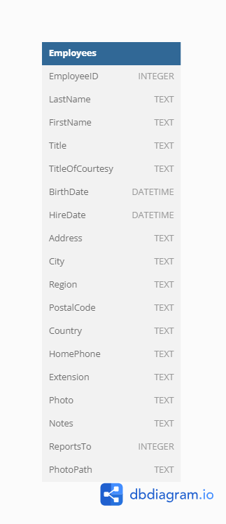

# Northwind Employee Service (with ADO.NET)

A comprehensive .NET solution for practicing [ADO.NET](https://learn.microsoft.com/en-us/dotnet/framework/data/adonet/) data access patterns. This project demonstrates how to connect to a database, retrieve data, and perform CRUD operations on employee records stored in a [SQLite](https://www.sqlite.org/index.html) in-memory database.

## 📋 Overview

This intermediate-level task focuses on implementing a data access layer using ADO.NET to interact with the Employees table from the Northwind database. The solution includes both the main service implementation and comprehensive unit tests.

**Estimated completion time:** 3 hours

## 🚀 Prerequisites

- [.NET 8.0 SDK](https://dotnet.microsoft.com/en-us/download/dotnet/8.0) or later
- Basic understanding of C# and SQL
- Familiarity with ADO.NET concepts

## 🏗️ Project Structure

```
northwind-employee-service-adonet-tst-1/
├── NorthwindEmployeeAdoNetService/          # Main service library
│   ├── Employee.cs                          # Employee entity model
│   ├── EmployeeAdoNetService.cs             # Main service implementation
│   ├── EmployeeServiceException.cs          # Custom exception class
│   ├── DbProviderExtensions.cs              # Database extension methods
│   └── GlobalUsings.cs                      # Global using statements
├── NorthwindEmployeeAdoNetService.Tests/    # Unit tests
│   ├── EmployeeAdoNetServiceReadOperationsTests.cs
│   ├── EmployeeAdoNetServiceWriteOperationsTests.cs
│   ├── EmployeeEqualityComparer.cs
│   ├── EmployeesDataSource.cs
│   └── DatabaseService.cs
├── images/                                  # Documentation images
└── README.md
```

## 🎯 Task Description

Implement the `EmployeeAdoNetService` class to interact with the Employees table data of the Northwind database using [ADO.NET](https://learn.microsoft.com/en-us/dotnet/framework/data/adonet/). You will need to write methods for retrieving, adding, updating, and removing employee records stored in the [SQLite in-memory database](https://learn.microsoft.com/en-us/dotnet/standard/data/sqlite/in-memory-databases).

### 📊 Database Schema

Before starting the task, study the Northwind database diagram:



### 📚 Learning Resources

- Learn [Microsoft.Data.Sqlite](https://learn.microsoft.com/en-us/dotnet/standard/data/sqlite/?tabs=netcore-cli) ADO.NET provider for SQLite
- Review [SQLite documentation](https://www.sqlite.org/lang.html) for SQL syntax

### 🔧 Implementation Requirements

Implement the following methods in the `EmployeeAdoNetService` class:

#### Read Operations
- **`GetEmployees()`** - Retrieve a list of all employees from the `Employees` table
- **`GetEmployee(long employeeId)`** - Retrieve employee data with the specified ID from the `Employees` table
  - Create an `Employee` object from the retrieved data and return it
  - If the employee is not found, throw an exception with the message "Employee not found."

#### Write Operations
- **`AddEmployee(Employee employee)`** - Add a new employee record to the `Employees` table
  - Method must return the ID of the newly added employee
  - If the insertion fails, throw an exception with the message "Inserting an employee failed."
- **`UpdateEmployee(Employee employee)`** - Update employee information in the `Employees` table
  - If the update fails, throw an exception with the message "Employee is not updated."
- **`RemoveEmployee(long employeeId)`** - Remove the employee with the specified ID from the `Employees` table

> **Note:** Detailed task specifications are provided in the XML comments for each method in the source code.

### 📦 Data Model

An employee is represented by the [Employee](/NorthwindEmployeeAdoNetService/Employee.cs) class, which includes properties such as:
- Basic information (ID, FirstName, LastName, Title)
- Contact details (Address, City, Region, PostalCode, Country, HomePhone)
- Employment details (HireDate, ReportsTo, Extension)
- Personal information (BirthDate, TitleOfCourtesy, Notes, PhotoPath)

## 🚀 Getting Started

1. **Clone the repository:**
   ```bash
   git clone <repository-url>
   cd northwind-employee-service-adonet-tst-1
   ```

2. **Restore dependencies:**
   ```bash
   dotnet restore
   ```

3. **Build the solution:**
   ```bash
   dotnet build
   ```

4. **Run tests:**
   ```bash
   dotnet test
   ```

## 🧪 Testing

The project includes comprehensive unit tests covering:
- Read operations (GetEmployees, GetEmployee)
- Write operations (AddEmployee, UpdateEmployee, RemoveEmployee)
- Error handling scenarios
- Data validation

Run tests with:
```bash
dotnet test --verbosity normal
```

## 📖 Additional Resources

### SQLite Documentation
- [SQLite SQL Language](https://www.sqlite.org/lang.html)
- [SQLite Data Types](https://www.sqlite.org/datatype3.html)

### Microsoft.Data.Sqlite
- [Microsoft.Data.Sqlite Overview](https://learn.microsoft.com/en-us/dotnet/standard/data/sqlite/)
- [Connection Strings](https://learn.microsoft.com/en-us/dotnet/standard/data/sqlite/connection-strings)
- [Data Types](https://learn.microsoft.com/en-us/dotnet/standard/data/sqlite/types)
- [Parameters](https://learn.microsoft.com/en-us/dotnet/standard/data/sqlite/parameters)
- [Metadata](https://learn.microsoft.com/en-us/dotnet/standard/data/sqlite/metadata)

### ADO.NET Resources
- [ADO.NET Overview](https://learn.microsoft.com/en-us/dotnet/framework/data/adonet/)
- [DbProviderFactory](https://learn.microsoft.com/en-us/dotnet/api/system.data.common.dbproviderfactory)
- [DbConnection](https://learn.microsoft.com/en-us/dotnet/api/system.data.common.dbconnection)
- [DbCommand](https://learn.microsoft.com/en-us/dotnet/api/system.data.common.dbcommand)

## 🤝 Contributing

This is a learning project. Feel free to:
- Report issues
- Suggest improvements
- Submit pull requests

## 📄 License

This project is for educational purposes.
